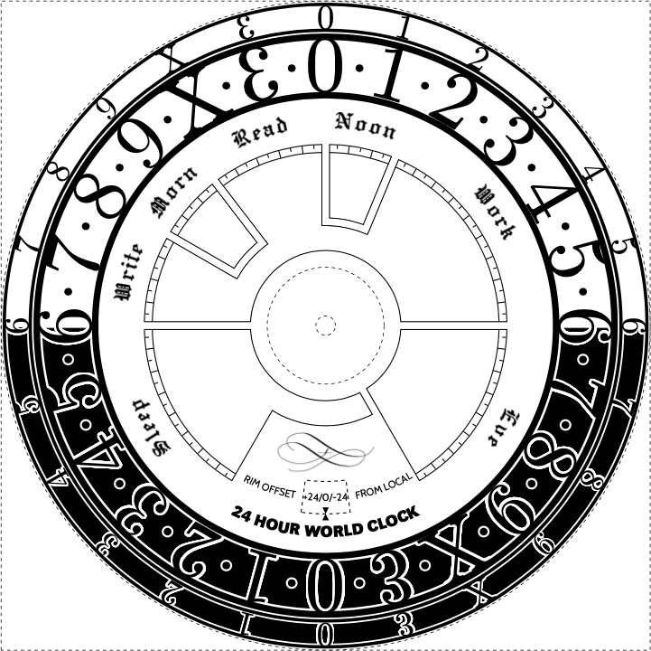

24-Hour World Clock and Daily Routine
=====================================

This is a project to implement an elegant wall clock that tells me the time,
and a few other things.

* It's a 24 hour analog clock, and with only an hour hand, for a more direct
  time-reading experience.
* The face incorporates my ideal daily routine, to help me work towards that
  ideal every day.
* A second dial shows a time in another time zone with a configurable offset,
  for immediate time reading across time zones.

The clock face is currently being designed in this repository:

The outer rim rotates independently and the outer numbers then represent the
time in another time zone (see below).

Project notes
-------------

TODO List:

* [x] Select and order 24 hour mechanism and clock hands
* [x] Design clock face and dial
* [x] Iterate dial design
* [x] Order dial and bezel
* [ ] Print clock face on good paper and assemble clock
* [ ] Incorporate into wall dashboard (with barometer and thermometer)

Design notes
------------

**A dozen numerals**

The numerals use a [dozenal](https://en.wikipedia.org/wiki/Duodecimal) (base
12) system, because I prefer the look, and I'm the only one who has to read
this clock. I'm using letters X for ten and E (reflected 3) for eleven.

I don't really like the popular conventions for the transdecimal numerals
ten and eleven (though I understand their appeal and accept their popularity).
For what it's worth, I might propose using X for ten, Y for eleven, and Z for
twelve (if a symbol other than 10 were needed), pronounced "dex, (ele)vyn,
doz".
X, Y, Z shares the alphabetic sequence; X matches the roman numeral for ten,
and Z is for zwölf (german for twelve) as well as a prominent letter in the
word 'dozen'.
Accordingly, I would use the letter z to denote base-12 literals in
programming (as in 0z10X = 154).
But nobody is asking me :).

**A readable world clock.**

Digital world clocks show the *current* time in multiple places, but to figure
out what the world time will be at some other local time, one has to *think*.
Analog world clocks---with one dial per timezone---are even worse, because 
one also has to *think* just to read the *current* times.

This is an analog world clock that displays *two* timezones on *one* dial.
The outer dial has a configurable offset from the main dial. The hour hand
will therefore point out the local and world time together (including AM/PM
status, since it's a 24 hour clock).
The world time at any other local time can be readily assessed by looking at
other points around the dial.

Fonts
-----

* Gothic font: https://tug.org/FontCatalogue/hersheyoldenglishfont/
* Black sans-serif font: https://tug.org/FontCatalogue/qthelvetblack/
* Regular sans-serif font: https://tug.org/FontCatalogue/cabin/

Clock parts
-----------

This is not just a design, I'm making a real clock for my wall. Apart from
the face, which I'll print on some cream paper or something, I ordered the
clock parts from letsmaketime in Queensland:

* [24hr clock movement](https://www.letsmaketime.com.au/shop/item/24-hour-clock-movement-3mm-6mm---qc-24/high-torque)
* Hands (cut down to fit inside)
  * probably [this hour hand](https://www.letsmaketime.com.au/shop/item/large-clock-hands-175mm-hth180)
  * or possibly [this hour hand](https://www.letsmaketime.com.au/shop/item/retro-german-clock-hands-147mm)
* [Glass and brass bezel](https://www.letsmaketime.com.au/shop/item/hinged-dial-glassbrass-bezel-ivory-arabic-215-copy)

License
-------

My idea for this configurable 24 hour world clock dual dial design is hereby
dedicated to the public domain.

